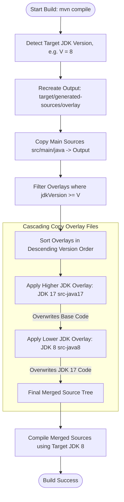

# Source Overlay Maven Plugin

[](https://openjdk.org/)
[](LICENSE)

A lightweight, highly configurable Maven plugin designed for multi-JDK builds from a single unified codebase. It dynamically merges base source code with version-specific compatibility overrides (overlays) during the `generate-sources` phase.

---

## Key Capabilities

- 🛠️ **Dynamic Configuration:** Fully configure paths for main sources, generated sources, file exclusions, and version-specific overlays directly in your `pom.xml`.
- 🔍 **Auto JDK Version Detection:** Resolves the target compilation version automatically by inspecting standard Maven compiler properties (`maven.compiler.release`, `maven.compiler.source`, or `maven.compiler.target`).
- 🧬 **Cascading Version Inheritance:** When building for a lower Java release (e.g., JDK 8), the plugin automatically applies matching overlays (e.g., JDK 17 then JDK 8) in descending version order. This allows older overlays to extend and supplement intermediate versions, completely eliminating codebase duplication.
- 🚫 **Dynamic Excludes:** Exclude specific directories or helper classes from being copied into the final generated source tree.

---

## Installation & Configuration

Add the plugin declaration to your Maven project's `pom.xml`:

```xml
<plugin>
    <groupId>com.github.watashi-00</groupId>
    <artifactId>source-overlay-plugin</artifactId>
    <version>1.0.4</version>
    <configuration>
        <!-- The directory of the main/modern source code -->
        <mainSources>src/main/java</mainSources>
        
        <!-- Target directory where the merged code will be generated -->
        <generatedSources>target/generated-sources/overlay</generatedSources>
        
        <!-- Files or directories relative to source roots to exclude -->
        <excludes>
            <exclude>com/example/ignoredpackage</exclude>
        </excludes>
        
        <!-- Configured JDK version overlays -->
        <overlays>
            <overlay>
                <jdkVersion>17</jdkVersion>
                <directory>src-java17</directory>
            </overlay>
            <overlay>
                <jdkVersion>8</jdkVersion>
                <directory>src-java8</directory>
            </overlay>
        </overlays>
    </configuration>
    <executions>
        <execution>
            <phase>generate-sources</phase>
            <goals>
                <goal>overlay</goal>
            </goals>
        </execution>
    </executions>
</plugin>
```

---

## How It Works (Cascading Lifecycle)

When the Maven build triggers the `overlay` goal during the `generate-sources` lifecycle phase:

```
1. Reads properties: maven.compiler.release / source / target
2. Resolves compile target version (V)
3. Deletes and recreates the <generatedSources> folder
4. Copies all files from <mainSources> to <generatedSources> (respecting <excludes>)
5. Filters overlays where jdkVersion >= V
6. Sorts matching overlays in DESCENDING order of jdkVersion
7. Applies overlays sequentially (overwriting duplicate files):
   e.g. For JDK 8 target:
        -> Applies JDK 17 overlay first (src-java17)
        -> Applies JDK 8 overlay next (src-java8) overwriting any previous implementation
```

Here is a visual flowchart of the cascading lifecycle:



This ensures that intermediate compatibility overrides (like platform class overrides written for Java 17) can be reused seamlessly by older profiles (like Java 8) without duplicating the actual source code files across folders.

---

## Logging Output Example

```text
[INFO] --- overlay:1.0.4:overlay (default) @ your-project-artifact ---
[INFO] Initializing source overlay generation.
[INFO] Main sources directory: /path/to/project/src/main/java
[INFO] Generated sources output: /path/to/project/target/generated-sources/overlay
[INFO] Configured exclusions: [com/example/ignoredpackage]
[INFO] Configured overlays: [Overlay[JDK 17 -> src-java17], Overlay[JDK 8 -> src-java8]]
[INFO] Base sources copied successfully.
[INFO] Resolved target Java version: 8
[INFO] Applying JDK 17 overlay from: src-java17
[INFO] Applying JDK 8 overlay from: src-java8
```

---

## License

This plugin is licensed under the MIT License.

---

Created and maintained by watashi-00 (watashi00 | Rodrigo).
